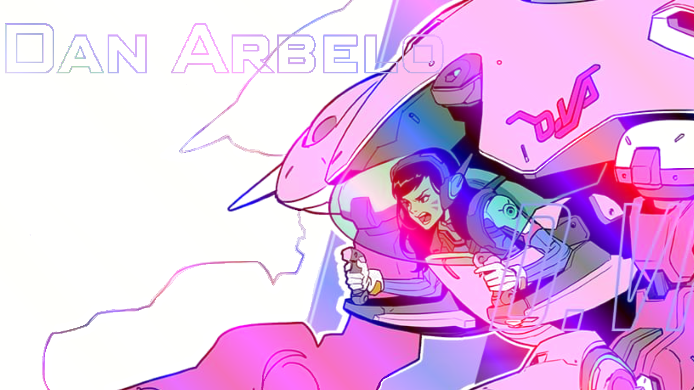

  <h1> Hi 👋, I'm Dan</h1>
    <h2>An enthusiastic fullstack developer</h2>
      
      
          

  

I love to bring my creativity to life in ways that 8 year old me would love to see, but 54 yr old me would still be excited to do business with.

 

## Followers
 

✨[@KashCodes](https://github.com/KashCodes)✨ | 🧙[@davidwu92](https://github.com/davidwu92)🧙 | 🦸‍♀️[@vloebel](https://github.com/vloebel)🦸‍♀️ |  :shipit:[@gwarzecha](https://github.com/gwarzecha):shipit:
--- | --- | --- | ---
🎆🎆 |  |  | 

  
  
  

  
  

   

  

  ## My Stats
   
 
  

  

  ## Contact Me
  :shipit: Send me an 📜 [email](mailto:dan@arbelo.me) 

